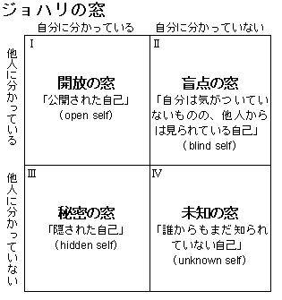

# Manager README

[TOC]

# What is this?

これは、[この記事](https://hackernoon.com/12-manager-readmes-from-silicon-valleys-top-tech-companies-26588a660afe)にインスパイアされて書いた、自己紹介を兼ねた私の取り扱いに関するドキュメントです。 **チームのビジョンや年度目標ではありません。** 主に以下のようなことについて書かれています。

* 私の仕事観
* 自分の責任だと感じていること
* メンバーの皆さんに約束したいこと
* フィードバックやコミュニケーションの取り方

この内容に従えという訳ではなく、 **お互いが円滑に良い関係を持つために知っておいてほしいこと** です。これによって何かを強制したりすることはありません。

**以下のことについて私がうまく立ち回れていない場合は、できる限り早く私に知らせてください。私にはそれを改善する必要があります。**

# About me

阿部信介(あべしんすけ)です。

岡山に住んでいて、家族は妻と犬1頭です。結婚してだいぶ経ちますが、子供は最初に話し合って設けないと決めました。その理由については諸事情あるので多くは語らないようにしていますが、かといってチーム内の雑談で子供の話題を避ける必要はありません。

鼻炎持ち(花粉症+その他)なので、3月下旬から5月上旬は集中力が低下する日があります。なるべく対処はしますが、パフォーマンスに影響が出る場合があります。

どちらかというと内向的です。大勢が集まっているところでは少し発言が減る傾向がありますが、興味がないわけではありません。考えながら発言するというよりは、考えてから発言するタイプです。問題が入り組んでくると一人で考える時間が必要になります。その時は皆さんにお知らせします。

また、切羽詰まってくると小さなタスクをこなして現実逃避をしようとすることがたまにあります。本来別のことをしなければならない状況で、私がそういうことをしていた場合は指摘をしてください。

私のマネージャとしての仕事のあり方を形作ったものは、

* Team Geek
* ピープルウェア
* 平鍋さんのプロジェクトファシリテーションの資料

です。Agileなチームの文化は好きですが、採用するプロセスが特定の何か(Scrum|XP|WF|Kanban)でなければならないというスタンスではありません。

SFと女神転生シリーズとペルソナシリーズの話題についてはかなりの頻度で食いつきます。

# マネージャとしての責務

私の一番の責務は、チームとメンバーが成功することです。そのために必要な全ての働きかけを行います。

それは「貴方がどうすべきか」という能動的な指示ではありません。(会社|チーム|ユーザ)が何故それをするのか、どんなビジョンを持っているのかについてお伝えし、関係する全ての人が同じ文脈を共有できるように場をメンテナンスすることです。私はそのためのスキルセットを整えるよう努力します。

また、メンバーである貴方が、チームが取り組む仕事や課題を通じて、より良い成長(エンジニアリング、キャリア両面において)ができるように支援します。そのために、チームの信頼感と文化を醸成する活動をします。そのために必要な権限と責任に関しては積極的に委譲しますが、それはマネージャからのサポートがないことを意味しません。私は、このチームにおいてサーバントとして振る舞うよう努力します。

私も完璧な人間ではないので、常にそのように振る舞えているわけではありませんが、特に上記のことができていない場合は率直にフィードバックをください。

## すべきと思っていること

上記責務を果たすために、より具体的には以下のような仕事に取り組みます。

このリストは役職(組織上のポジション)として定義されている仕事のリストではなく、私がマネージャとしてやるべきと思っている仕事です。これ以外のことをやらないわけではありません。

* 会社とチームのビジョンの達成に向けて思っていることを発信します
* 各メンバーの成長とその方向性について相互に納得を図り、その実現を支援します
* 上2項を達成するチームのコミュニケーションルールを維持管理します
* チームに出てくる課題を解決するためのサポート
* チームの価値をより高める人を採用します
* チームのナレッジをより高いレベルに方向づけます(参考：[SECIモデル](https://ja.wikipedia.org/wiki/%E3%83%8A%E3%83%AC%E3%83%83%E3%82%B8%E3%83%9E%E3%83%8D%E3%82%B8%E3%83%A1%E3%83%B3%E3%83%88))
* 技術検証などのコードは書きます

## すべきでないと思っていること

逆に、責務を果たすためにやるべきではないと思っていることは以下です。

* コマンドコントロール
* チームの課題を放ってコードを書くこと

## North Star Pinciples

### 楽しく仕事をしましょう

**私にとって仕事の楽しさとは、仕事を通じて知的な充足感、金銭的な満足、チャレンジに対する達成感を得るエキサイティングなことです。**そのためには、私自身も成長していく必要がありますが、チームもエンジニアリングおよびキャリア両面での成長を促していく場である必要があると思っています。

このチームで得られる楽しさとそれに向けた成長の方向性についてお互いに話をしましょう。

### HRT原則を重視します

チームには様々な問題が発生しますし、お互いの仕事に対して無関係でもありません。それらを解決していくベースになるのは、チームメンバーへの信頼感です。私は、お互いに信頼して仕事をするために、以下の原則が必要だと考えています(参考：Team Geek)。

1. 謙虚(Humility)
2. 尊敬(Respect)
3. 信頼(Trust)

私は完璧な人間ではありませんが、このチームで働くに当たってメンバーの皆さんに接する際にこれらが伝わるように務めます。

### 責任のある大人として扱います

メンバーの皆さんは、その優秀さやポテンシャルをもってこの場にいます。そして、皆さんがこのチームが成し遂げるものや現状のプロジェクトに対して、常に最善を尽くしていると信じていますし、そのように接します。基本的には皆さんが携わっている仕事のやり方において、皆さんよりうまくできる人はいないと思っています。

だから、今のあなたでうまく行かないことは、一人で抱え込むべきではありません。どうか私やメンバーの助けを求めて、学びを得て、課題を解決してください。その課題解決に向けた判断をするのもあなたの責任で、そのためにチームがあると思っています。

### 私たちに合うやり方を探します

**これは決して外からの批判的な指摘を受け入れないということでも、外部の良い事例を受け入れないということでもありません。**

盲目的に何かを受け入れるのではなく、それら指摘や事例を私たちチームがより良くなっていくためにどのように活かせば良いか、と考えていきます。指摘やオープンにされた事例に対する謙虚さは忘れずに、自分たちチームの価値に合うかどうかは真摯に考えます。

**チームをより良い状態に進めるための行動責任は私たち自身にあります。**外部の批判や事例に責任を押し付けることはしません。

## スケジュールについて

私の全ての予定は社内のカレンダーに表示されるようにします。空いているところにはいつでもミーティングをいれていただいて構いません。

朝起きるのが早いので、動き出しは早いです。自宅で仕事をするときは7:30から8:30の間には仕事を始めていると思います。そのときは、少しゆっくり昼食をとりたいので、昼休憩は長めになります。仕事の終わりは17:00から18:00の間になります。オフィスで仕事をするときは、9:00から18:00のスケジュールになると思います。

妻が定期的な通院が必要なので、そのスケジュールでは必ず自宅勤務となります。病院の送り迎えの時間帯では素早いレスポンスができないことがあります。ご了承ください。

# One-on-Ones

月一回で各位最低30分ずつ時間をとって、One-on-Onesミーティングを実施します。**最低30分**なので、それ以上話したいことがある時は伸ばしましょう。話す内容やスケジュールは各位に合わせて一緒に作って行きます。

**進捗確認を主とする場ではありません。**それらの話題にも触れますが、なるべく日常の仕事の中で必要に応じて私から伺いますし、訊かなくてもわかるような可視化にも取り組みます。目的は雑談をしやすくすることで、仕事を通じて得たものやパフォーマンスについてのフィードバック、気分的(良いことも悪いことも)なもの、今後のキャリア、趣味やはまっていることなどについて話をして、**お互いをより深く知ることを重視する場**です。日常の雑談をしないというつもりはありませんが、離れた場所で働く人の多いチームですので、意識的に話をする場を設けておきたいと思います。

チーム事情を考慮して基本的にはハングアウトで実施します。カジュアルに話をしたいので、コーヒーやお茶、おやつを準備したり、お互いリラックスできる環境で話をしましょう。年に1,2回は直接話ができるようにしたいと思っています。その時はオフィス近くのカフェに行って話をしたいと思います。

# 私へのフィードバックについて

私について思うところがある時は、率直で適時なフィードバックを望みます。私へのフィードバックについてはOne-on-Onesミーティングを待つ必要はありません。

できれば良いと感じたところも合わせてフィードバックしてください。皆さんが良いと思っているところについては方向性を変えずにより良くなるようにしていきたいからです。

もらったフィードバックのうちマイナス方面についてはポストモーテムを作って、フィードバックに対する学びを可視化するように努めます。ポストモーテムに含まれることは主に以下の事柄です。

* 発生したことや影響範囲
* 緩和や解消のためのアクション
* 根本原因
* 再発防止策

## 偉大なチームになるために

フィードバックの目的はジョハリの窓における「開放の窓」を広げることです。

**率直で敬意に満ちたフィードバックがあるチームは、学びに満ち、偉大な仕事を成し遂げます。** そのために、フィードバックについて以下の原則が守られるように気を配ります([参考](https://medium.com/@royrapoport/why-wont-you-talk-to-me-f30a01a1994c))。

- フィードバックをすることによって不利益を被ることはありません
- フィードバックをするための資格があるわけではありません、フィードバックは何かと引き換えにするものではありません
- ポジティブで次へのアクションを後押ししてくれるようなフィードバック

オンサイトにいないことの多いチームです。テキストのコミュニケーションが中心になるために、ノンバーバルな情報がかなり落ちます。フィードバックをする際は、ビデオチャットで表情なども含めて伝わるように私も気をつけます。

# 何か言いたいこと、聞きたいことがあるときは

リモートになるので、まずはチャットを使って投げかけてください、いつでも。あなたからの必要なことを聞いてアクションにつなげるのが私の仕事です。

# Notes

このドキュメントは**未完成**です(永遠に)。私がチームとともに成長するにしたがって、このドキュメントは内容が変わることがあります。

